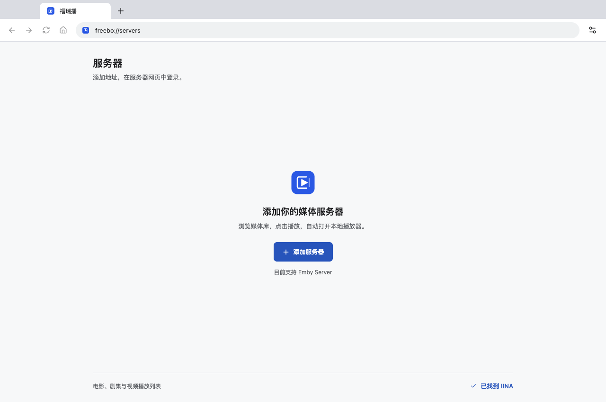

# Freebo

<picture>
  <source media="(prefers-color-scheme: dark)" srcset="assets/brand/freebo/svg/logo-on-dark.svg" />
  
</picture>

[English](README.en.md)

在 Emby 网页中选择视频，用本地播放器观看。

Freebo 把服务器管理、播放器发现和播放衔接放在一个桌面应用里。打开应用，添加 Emby 地址，在原有网页中登录，即可将视频交给本地播放器。无需安装浏览器脚本、配置 Python 或单独启动服务。

项目处于首版开发阶段。支持范围和实际验证结果见 [验证记录](docs/validation.md)。

## 界面与品牌



[播放器设置](docs/assets/settings.png) · [品牌规范与源文件](docs/brand/README.md) · [品牌素材 ZIP](assets/brand/freebo/Freebo-brand-kit.zip) · [PDF 指南](assets/brand/freebo/Freebo-brand-guide.pdf)

截图来自真实 macOS Electron 应用的干净隔离配置，展示已选导盲犬与 Atma 600 品牌；截图不扩大真实播放和跨平台验收结论。本轮品牌调整未更新外部项目网站。

## 功能

- 使用 Emby 原有网页浏览媒体库、搜索和管理账户。
- 多服务器管理，各服务器使用独立的持久化网页登录会话。
- 首次配置引导并扫描 IINA、mpv、mpv.net、VLC，Windows 还支持 PotPlayer、MPC-HC、MPC-BE；之后按需手动扫描，提供默认播放器选择、手动定位和安装指引。
- 电影、剧集、视频播放列表、连续播放、断点续播和观看进度回传。
- 解析 Emby 视频版本、字幕和音轨选择。
- 主页展示服务器列表，设置统一管理服务器与播放器。
- 地址栏播放按钮打开独立浮窗，显示播放状态与队列，并可跳转到当前资源的网页详情；不改变 Emby 网页尺寸。
- 点击播放后立即显示准备状态，并在视频就绪后激活播放器。诊断页可查看进度回传结果、复制信息、导出日志和打开 GitHub 问题创建页；关于页提供产品与仓库链接。
- 图形化设置和诊断日志。
- 接近 Chrome 的桌面标签栏、自定义标题栏和导航工具栏。
- 中文、英文及跟随系统的界面语言，支持明暗外观。

音乐和直播使用 Emby 网页播放。首版的外部播放器接管只作用于应用内网页。应用不附带播放器，请先安装适合自己系统的播放器。

## 使用

1. 安装应用并打开，跟随首次配置指引选择播放器、添加 Emby 地址。
2. 若没有播放器，打开安装指引，安装后重新扫描或手动选择；也可以稍后配置。
3. 打开服务器，在它自己的网页中输入账号和密码。
4. 点击 Emby 网页中的视频播放按钮，启动所选播放器。
5. 点击地址栏旁的播放图标，打开控制与播放列表浮窗；点击标题右侧的服务器图标可跳转到对应详情页。

Emby 的继续观看遵循媒体库的最小续播比例，短时播放可能有播放次数与最近播放时间，但不保留续播进度。停止后，设置中的诊断页会核对服务器保存的观看记录、进度及可读取的续播门槛。

之后打开应用进入主页。服务器添加、编辑和登录会话管理统一放在设置中；播放器不会在每次启动时重新扫描，安装或移动播放器后可在设置中手动触发。

播放器在便携目录或自定义位置时，使用设置中的文件夹按钮选择应用。服务器地址支持端口和反向代理子路径。

## 开发

需要 Node.js 22.12 或更新版本，以及 pnpm。

```sh
pnpm install
pnpm dev
```

使用 `prek install` 安装提交前检查；提交时统一执行应用与品牌预览的格式、lint、类型、测试和构建检查。

直接运行本地生产版使用 `pnpm start`，会先完整构建页面、主进程和预加载，再启动 Electron，避免新旧构建产物混用。

```sh
pnpm check
pnpm package
```

工具链：React、TypeScript、Electron、Vite、Vitest、Oxlint、Oxfmt。Electron 主进程负责会话、媒体传输和播放器通信，React 管理设置界面，独立的 `WebContentsView` 加载服务器网页。

媒体服务器通过 Provider 接口接入，网页注入、认证、媒体解析和进度回传由各 Provider 负责。当前只注册 Emby，扩展架构不改变首版的支持范围。详见 [架构说明](docs/architecture.md)。

## 构建与发布

GitHub Actions 配置为在 macOS、Windows、Linux 上执行检查，分别生成 macOS arm64/x64、Windows x64、Linux x64 安装包。工作流运行后保留安装包供下载；`v*` 标签生成包含校验和的草稿 Release。

当前工作流默认生成未签名安装包。正式签名和 macOS 公证需要维护者配置证书与对应凭据。

品牌素材使用 `pnpm brand:generate` 生成，`pnpm brand:preview` 在本地提供品牌素材下载页。源文件、字体授权及复现说明见 [品牌规范](docs/brand/README.md)。本轮品牌调整维持版本 0.1.0。

## 许可证

[Apache-2.0](LICENSE)。感谢 [embyToLocalPlayer](https://github.com/kjtsune/embyToLocalPlayer) 提供的协议与行为参考。
