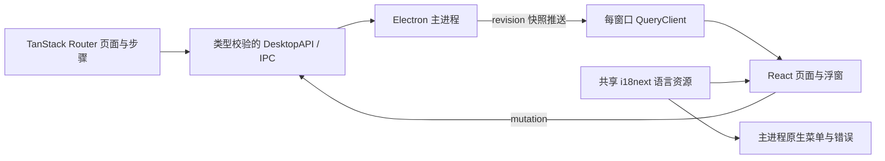
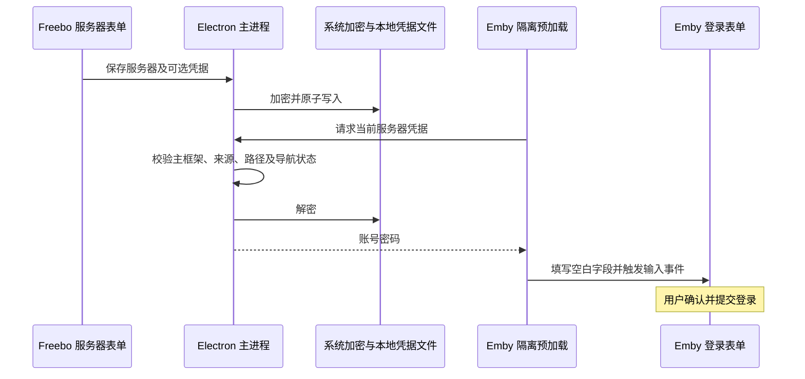

# Freebo 架构

Freebo 使用服务器原有网页提供浏览与登录，把视频播放交给本地播放器。当前只有 Emby Provider；注册表可扩展到其他服务器，界面不会列出尚未实现的支持项。

本文件维护当前实现。界面组成见 [设计规范](design.md)，构建命令见 [开发指引](development.md)；运行验证范围集中于文末。

## 渲染端路由与数据

`src/router.tsx` 定义 TanStack Router 的类型化路由树，主页、服务器网页、设置各页、服务器新建与编辑、快速配置及两个浮窗分别对应路由。设置使用嵌套 `Outlet`；编辑目标由路由参数决定，快速配置步骤与该次配置新增的服务器 ID 由受校验的搜索参数决定。使用 [memory history](https://tanstack.com/router/latest/docs/guide/history-types)，避免修改生产 `file://` 入口及浮窗的 `surface` 参数。设置与快速配置按路由加载。

路由进入前通过 IPC 同步原生网页视图的显隐及服务器身份。原生 IPC 无法中途取消，因此页面切换串行执行，较后的主页跳转不会被较早的服务器打开请求覆盖。主进程菜单、播放浮窗及服务器选择浮窗也可能发起跳转；`connectNativeNavigation` 将这些状态映射回路由，同时保留同一设置页的编辑目标与快速配置步骤。

`src/runtime/desktop.ts` 为每个窗口建立 TanStack Query 客户端。主进程仍是持久设置、网页登录会话与播放会话的唯一拥有者；渲染端首次通过 `getState` 读取快照，后续 IPC 推送及 mutation 返回值直接更新缓存，不做周期轮询。快照带递增 `revision`，较早的读取或操作结果不能覆盖较新的推送。应用操作的进行中和错误状态由 mutation 管理，操作缓存只保留名称与标识，不保留可能捕获账号密码的表单回调；诊断由 query 管理并支持手动刷新。IPC 查询和操作均禁用自动重试、窗口聚焦重取及联网恢复重取，离线时也可管理本地设置。

账号密码读取使用仅随表单存活的 query（`gcTime: 0`），不进入全局快照或持久化 Query 缓存；连接测试使用不重试的 mutation，表单内容变化后忽略旧测试结果。结果保留语义数据及原始错误键，切换语言时重新翻译。

当前不另外引入全局状态管理库：共享异步数据由 Query 拥有，页面位置由 Router 拥有，标签集合、确认框、表单草稿及拖动预览留在其所属组件。React Context 仅提供窗口运行时与操作接口，不复制 Query 中的数据。

## 服务器边界

`electron/providers/types.ts` 定义两个接口：

- `MediaServerProvider`：提供服务器名称、地址归一化、网页入口、隔离预加载脚本、注入脚本和播放请求解析。
- `PlaybackClient`：解析队列、准备媒体、生成当前登录服务器的资源详情地址及报告开始、进度、停止事件。

`ProviderRegistry` 负责注册、查找与会话分区。每个服务器记录包含 `providerId`，旧记录缺省为 `emby`。Emby 保留原有浏览器分区名，使升级后的登录会话可以继续使用。

Emby 的网络 DTO、认证、字幕、音轨、版本和网页模块细节仅存在于 `electron/providers/emby/`。播放管理器使用通用的 `PlaybackItem`、`PlaybackSource`、`PreparedMedia` 和 `PlayIntent`，不依赖 Emby 的字段格式。测试使用独立的假 Provider 和假客户端验证这条边界。

## 播放与安全

Emby 网页主世界只暴露窄的播放请求桥。主进程校验请求来源必须是当前服务器的主框架，并校验认证地址属于注册服务器的来源和子路径。网页视图禁用 Node.js，启用 sandbox、context isolation 和 web security。

媒体代理与播放器适配器负责本机传输和播放器通信；播放管理器处理会话切换、队列、断点、跨集轨道匹配和观看进度。新增服务器不需要重写这套播放器生命周期，但需要实现其认证、媒体解析及进度协议。

播放器连接成功与视频加载完成分开判断；地址栏在准备期间显示文字及加载动画。有效位置和时长就绪后才报告开始事件，暂停、恢复及跳转立即报告进度，正常播放每 10 秒回传一次，停止前读取最后位置。回传串行执行并保留重试、时间、结果和脱敏错误；旧会话的结果不会覆盖新会话诊断。Emby 请求保留网页登录的认证和设备身份，带媒体、播放会话、时长、当前位置和轨道字段，进度事件使用 [ProgressEvent](https://dev.emby.media/reference/pluginapi/MediaBrowser.Model.Session.ProgressEvent.html) 的 TimeUpdate/Pause/Unpause。

停止回传成功后，Emby Client 不使用缓存重新读取用户条目的 UserData，将服务器保存的进度、播放次数与最近播放时间返回给通用播放管理器。若服务器保存了零进度且条目尚未播放完成，再尽力读取所属媒体库的 MinResumePct，解释短时播放为何没有继续观看。读取失败作为“无法核对记录”展示，不重试已经成功的停止请求。接管播放时沿用网页 ApiClient 的 ensureWebSocket，接收 UserDataChanged 通知，更新网页缓存。

Windows 的 PotPlayer、MPC-HC、MPC-BE 使用独立的 `WindowsPlayerSession`。随包内嵌的 C# 桥由系统 Windows PowerShell/.NET Framework 编译运行，不额外安装服务、开启 HTTP 控制端口或修改播放器偏好。MPC-HC/BE 通过 `/slave` 和 [WM_COPYDATA 协议](https://github.com/clsid2/mpc-hc/blob/develop/src/mpc-hc/MpcApi.h) 接收状态；PotPlayer 使用 WM_USER 时间及播放控制消息。桥只接受所启动进程 PID 的通知，窗口消息有超时；每项以新进程启动，保持独立恢复位置和队列身份。MPC 支持轨道选择；PotPlayer 音轨与内嵌字幕需在播放器内选择，回传时不宣称已应用网页选择的索引；播放器内变更轨道的回传仍待实现。Windows 窗口通过恢复最小化和 SetForegroundWindow 激活，系统前台窗口策略可能拒绝焦点请求；macOS 通过系统 JXA 调用 AppKit 的 NSRunningApplication，按当前会话 PID 激活；IINA 的 PID 根据唯一 IPC 参数与可执行路径识别，不按应用名选择旧实例。mpv 另尝试设置 focus-on，Linux 的启动焦点由窗口管理器决定。

## 桌面与语言

中文和英文文案分别放在 `src/shared/locales/zh.ts` 和 `en.ts`，由 i18next 管理插值与回退语言；资源键及两种语言的占位符保持一致。主进程使用独立的同步实例，React 页面通过 [I18nextProvider](https://react.i18next.com/latest/i18nextprovider) 和 `useTranslation` 订阅当前窗口的语言，不再逐层传递翻译函数。`src/shared/i18n.ts` 仅保留实例配置、系统语言解析与可序列化的错误接口。主进程返回带键和参数的错误，渲染端按当前语言翻译，因此切换语言也会更新已经显示的错误。服务器网页自身的语言由服务器控制。

React 渲染标签栏、工具栏、首次配置、主页和设置。主页只展示服务器；管理操作进入设置。首次进入播放器配置时扫描一次，结果及完成标记持久化；以后按需手动扫描，启动时不重新扫描。

Electron 使用隐藏标题栏配合各平台原生窗口控制。服务器网页视图根据顶栏和错误恢复栏定位，原生视图边界与渲染页面布局保持同步。播放信息和列表由地址栏按钮打开独立的原生子窗口，不挤压网页。该窗口使用本地沙箱预加载，通过受校验的 IPC 控制播放器，支持关闭、失焦收起和当前资源详情跳转。标题旁的服务器类型图标打开当前条目，Emby 路由带条目 ID 和远端 serverId，后者优先来自登录 ApiClient，旧请求缺少该字段时读取公开服务器信息补齐；Freebo 本地服务器 UUID 不作为远端标识。

主窗口的普通尺寸、位置和最大化状态单独保存在用户数据目录的 `window-state.json`，不与应用设置的异步保存竞争。移动、缩放和最大化后延迟写入，关闭时同步保存；最小化和全屏期间读取普通窗口边界。重启时根据当前显示器工作区域约束边界，避免断开外接显示器后窗口不可见。缺失或损坏的窗口状态使用默认尺寸。

服务器名称允许为空并原样保存；各处展示统一通过 `serverLabel` 回退到服务器地址。连接测试沿用内嵌 Emby 网页的 `Emby Web` 客户端身份，匿名检查公开信息，账号密码仅放在认证请求体中，随后注销测试令牌。401 与 403 分别提示账号认证失败和客户端／账号权限限制，避免将客户端白名单拒绝误报为密码错误。认证请求字段遵循 [Emby 用户认证规范](https://dev.emby.media/doc/restapi/User-Authentication.html)。

远端网页、图标、API、媒体和字幕请求使用同一 Chromium 会话与 `browserFetcher`。User-Agent 移除 Freebo/Electron 产品标识，保留实际 Chromium 与操作系统版本；Referer 去除片段，Origin 按请求方法和来源设置。播放 API 必须沿用网页 ApiClient 提供的客户端名称、版本、设备名称和标识；无法取得这些信息时保留网页播放器行为。遇到 401、403 或 429 后，当前播放请求通道停止继续请求，进度回传不对访问拒绝进行重试。连接测试使用服务器公布的 Web 版本及按用户数据目录和服务器地址生成的稳定设备标识，注销请求附带完整令牌认证信息；注销失败单独返回状态，不误报密码错误，也不静默声称测试会话已撤销。

原生服务器与播放浮窗收到 renderer 的 `surfaceReady` 通知后才定位并显示，通知在 React 完成挂载后的动画帧发送。两种浮窗共用 `PopupSurface`，每次打开都聚焦容器，避免原生窗口恢复关闭按钮等控件的旧焦点；后续状态更新不重置焦点，键盘 Tab 仍显示 shadcn 控件焦点。服务器浮窗保持标题和底部操作固定。服务器管理行以独立按钮覆盖图标、名称、地址和空白区域，点击进入编辑；打开、退出登录和移除为右侧独立操作。删除服务器与退出登录使用 shadcn AlertDialog，确认文案不重复服务器名称，仅说明操作和后果，默认聚焦取消，并在取消后恢复到触发按钮。主窗口开始关闭时停止广播、清理定时器并销毁子窗口；广播同时检查 BrowserWindow 和 WebContents 的存活状态，防止父窗口 WebContents 已销毁而子窗口关闭回调仍发送 IPC。

标签栏加号打开独立的服务器列表子窗口，同样使用沙箱预加载和受校验的 IPC，因此能显示在服务器 `WebContentsView` 上方。选择服务器后关闭浮窗并打开对应标签；点击添加服务器，由主进程切换到设置中的服务器页面，再通知主窗口显示空白表单。浮窗支持失焦收起、Escape 关闭、随主窗口移动及屏幕边界约束；较长列表在固定最大高度内滚动。

设置、首次配置、服务器表单和共享列表的交互规范见 [界面设计](design.md)。服务器和播放器图标由本地静态资源映射，来源见 [图标说明](integration-icons.md)。

诊断页显示系统架构和版本、Electron/Chromium/Node.js、服务器页面与播放接管状态、播放器、播放位置及最新回传结果。复制与导出使用同一份快照，不包含保存的凭据、服务器配置、播放器可执行路径和媒体队列；日志会隐藏 URL、令牌和当前媒体标题，最多保留 200 条。反馈按钮仅在 GitHub 创建页预填环境与复现模板，不自动提交或附带日志。产品、GitHub、问题页面均由主进程固定 HTTPS 目标，不接受渲染端任意链接。

Emby 接管由沙箱预加载在 DOMContentLoaded 时安装。先等待网页自己的登录连接，再加载播放模块；登录页与接管状态区分，初始化超时只自动重新加载一次，避免无限重试。

网页加载状态由 `did-start-loading` / `did-stop-loading` 驱动，DOM 就绪后仍等待资源加载完成才结束标签图标动画。加载时工具栏刷新按钮变为停止，调用 `webContents.stop()`；失败页面保留错误与恢复操作。非激活标签使用完整圆角 hover 背景，内部标题按钮保持透明；激活标签底部两侧以凹圆角衔接工具栏，滚动容器预留曲线空间，曲线不拦截指针操作。关闭按钮保留独立的圆形操作反馈。

标签页监听 Electron `page-favicon-updated`，使用服务器会话读取网站实际提供的图标，转换为图片 data URL 后传给自有界面，保持现有 CSP。图标限制格式、大小、候选数量和读取时间，按服务器 ID 与注册地址保存在内存中；异步结果不会覆盖已切换的网页。加载期间显示转圈图标，尚无有效缓存或图片解码失败时显示服务器类型图标；未注册图标的类型使用通用网站图标。

## 账号密码

添加或编辑服务器时直接显示账号密码表单，填写账号后保存即可记住，留空可仅保存服务器。`CredentialStore` 将账号和密码一起加密，存入用户数据目录的 `credentials.json`，不写入 `settings.json`、广播的 `AppState` 或诊断日志。文件采用原子替换和 `0600` 权限，写入串行化；加密或解密失败不会降级为明文。当前使用 Electron [safeStorage 异步接口](https://www.electronjs.org/docs/latest/api/safe-storage)，Linux 缺少系统密钥存储时禁用保存。

凭据绑定服务器 ID、Provider 和完整注册地址。主进程只向当前网页主框架的隔离预加载世界返回凭据，并检查来源和反向代理子路径；等待系统密钥读取期间若页面发生导航，则丢弃结果。凭据读取接口不暴露给网页主世界。

Emby 预加载在登录路由观察延迟出现的表单，兼容 `startup/manuallogin.html` 等部署路径和动态字段 ID，只填写可见的账号及现有密码字段，发送 `input` / `change` 事件，不自动提交。已输入的其他账号、密码及密码创建字段保持原样。退出登录只清除网页会话，保存的账号密码仍可自动填入；服务器表单不提供清除凭据操作，空账号提交不删除已有凭据，移除服务器同时移除凭据。修改服务器地址会清空表单中的旧凭据，需要明确重新填写后才会保存到新地址。

测试连接通过自有页面 IPC 调用 Provider，主进程规范化地址，使用 Electron Session 请求 Emby 的公开信息接口；填写账号时再调用 [Users/AuthenticateByName](https://dev.emby.media/doc/restapi/User-Authentication.html)。密码只放在请求体中，不跟随重定向。测试成功后尝试注销测试令牌，仅向渲染端返回服务器名称与是否通过认证，不保存凭据或更改网页登录会话。测试失败不会将上游响应体或网络异常中的敏感内容写入诊断；表单修改后清除旧测试结果。

## 界面组件与样式

通用控件使用 shadcn/ui，源码保存在 `src/components/ui/`；`components.json` 配置组件生成路径，Vite 接入 Tailwind CSS v4。按钮、输入框、标签、开关、单选组、进度条和折叠区共享组件实现。`OptionSelect` 组合 shadcn Select，统一主题、语言及 Provider 选择，菜单通过 Portal 展示并继承根节点主题。

页面布局使用 Tailwind。`src/style.css` 仅保留主题变量、基础排版、Electron 标题栏及地址栏规则和减少动态效果设置。系统外观变化同步 `.dark` 类，保证页面控件与弹出菜单一致；组件状态样式由 shadcn 管理，避免页面 CSS 覆盖下拉选项或禁用状态。

## 构建与升级

开发和生产共同使用 `scripts/build-electron.mjs`，先清理编译目录，再生成固定的 `main.cjs`、`preload.cjs`、`emby-preload.cjs`，避免移动源文件后误加载旧桥接脚本。

更名后用户数据目录为 `Freebo`。首次启动仅在新目录不存在时复制旧应用配置及浏览器会话，不覆盖现有目录，也不删除旧目录。配置新增的语言和 Provider 字段均有默认值。

## 验证边界

| 范围            | 当前确认                                                                                                                    | 尚未验证                                                         |
| --------------- | --------------------------------------------------------------------------------------------------------------------------- | ---------------------------------------------------------------- |
| macOS 开发版    | 真实 Electron / preload / IPC 的服务器管理、连接测试、窗口、浮窗、语言和外观操作；Emby 至 IINA 的进度、暂停、续播与连续播放 | 播放器视频画面的视觉验收；真实多音轨、内嵌及外挂字幕、多版本切换 |
| Windows / Linux | 播放器发现、协议适配和平台配置已有实现及自动化测试                                                                          | 原生播放器、窗口行为和各平台安装包实机运行                       |
| 打包            | 本地 macOS 未签名产物可构建                                                                                                 | 当前版本安装包完整运行、签名与公证；三平台发布验收               |
| 用户数据迁移    | 新目录缺失时复制旧目录的逻辑有自动化覆盖                                                                                    | 真实旧版本升级后的首次启动                                       |

开发版运行、自动化检查和打包构建各自验证其范围，不能相互替代。表格随相应实机验证更新。

## 当前限制与扩展点

PotPlayer 的音轨与内嵌字幕在播放器内选择；播放器内变更轨道的回传尚未实现。操作系统可能限制播放器窗口激活，Linux 的系统密钥存储决定能否保存凭据。

Provider 注册表可接入新的媒体服务器，但当前只实现 Emby。新增 Provider 需要实现其认证、媒体解析与进度协议，并单独验证；扩展接口不代表已支持或已承诺的后续功能。
