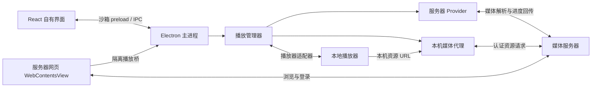
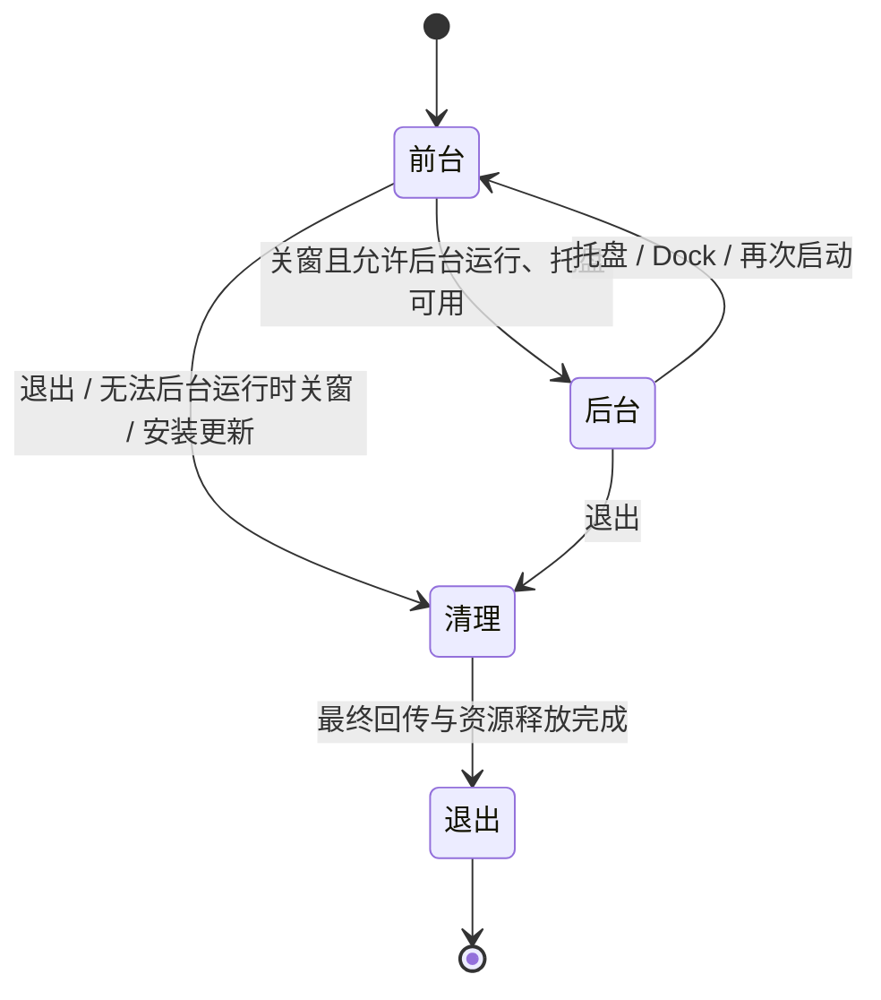

# Freebo 架构

Freebo 保留媒体服务器的网页浏览与登录体验，将视频播放交给本地播放器，并把观看进度同步回服务器。当前支持 Emby、Jellyfin 和 Plex；服务器发现、媒体库管理和转码由服务器负责。

本文件说明当前架构与关键设计决策。开发、集成测试和发布步骤见 [开发流程](development.md)，视觉与交互规范见 [界面设计](../DESIGN.md)。

## 整体结构

React 提供 Freebo 自身的界面，服务器网页由独立的 `WebContentsView` 承载，保留服务器原有功能。播放控制和服务器选择使用原生子窗口，避免被位于 React 页面上方的网页视图遮挡。

主进程协调原生窗口、服务器会话和播放资源。自有界面与远端网页使用不同的预加载接口，各自只能调用所需能力。

## 状态与导航

持久设置、网页登录会话和播放会话由主进程拥有。每个渲染窗口使用 TanStack Query 接收初始快照、IPC 推送及操作结果；递增的 `revision` 防止旧结果覆盖新状态，不通过轮询或自动重试反复执行 IPC 操作。

TanStack Router 管理页面位置，使用 memory history 保持 `file://` 入口稳定。路由切换同时协调原生网页视图；不可取消的原生导航按顺序执行，防止较早的请求覆盖后续跳转。

表单草稿、确认框等临时状态留在所属组件。React Context 只提供窗口运行时，不复制共享数据。跨进程错误传递语义键与参数，由当前界面的 i18next 实例翻译。

## 服务器与播放器扩展

服务器差异集中在 `electron/providers/`，通过两个接口接入：

- `MediaServerProvider` 管理服务器入口、连接测试、网页接管及播放请求校验。
- `PlaybackClient` 解析队列、准备媒体及回传观看进度。

`ProviderRegistry` 按服务器类型注册实现，Chromium 会话按 Provider 和服务器 ID 隔离。网页、API 和媒体请求复用对应会话及网页登录身份，避免额外登录和认证不一致。

Emby 与 Jellyfin 共用兼容的媒体解析底层，各自保留认证和网页适配；Plex 使用独立客户端，接入媒体服务器自身的网页与队列。仅接管本地视频播放，音乐、直播和远端播放继续由网页处理。

播放管理器使用统一的播放意图、队列和媒体类型，不依赖服务器 DTO。播放器通信由适配器封装；Windows 的 PotPlayer、MPC 系列通过本地 C# 桥通信，并按播放进程隔离会话。新增服务器或播放器只扩展对应接口，共用播放生命周期。

## 播放流程

1. 网页预加载捕获播放意图，经主进程校验后交给 Provider，沿用当前登录身份解析队列、续播点和轨道。
2. 播放管理器协调媒体代理与播放器适配器，将本机资源 URL 交给播放器。控制通道连接成功与媒体加载完成分别判断，取得有效位置和时长后才报告播放开始。
3. 播放器状态驱动开始、暂停、跳转和停止回传。请求按会话串行执行，旧会话的异步结果不能覆盖新会话；停止前读取最终位置，成功回传后再核对服务器保存的记录。记录核对失败不重复发送已经成功的停止请求。

队列切换、连续播放和轨道匹配由播放管理器统一处理，服务器协议留在 Provider 内，播放器能力差异留在适配器内。

## 信任边界与持久化

### 网页与凭据

远端网页禁用 Node.js，并启用 sandbox、context isolation 和 web security。播放桥仅接受当前服务器主框架的请求；认证地址及媒体、字幕资源必须属于注册服务器的来源与反向代理子路径。

媒体代理保留上游认证信息，播放器只获得本机不透明 URL，避免令牌进入播放器命令行或广播状态。系统目录和外部链接操作也由主进程限定目标，不接受渲染端任意路径或链接。

`CredentialStore` 使用 Electron safeStorage 加密保存账号密码，绑定服务器 ID、Provider 和完整注册地址。凭据不进入设置、全局状态或诊断；自动填充由通过来源与导航校验的隔离预加载完成，登录由用户提交。加密不可用时禁用保存，不降级为明文。

### 本地数据与诊断

用户数据目录分别保存设置、窗口状态、加密凭据及浏览器会话，避免不同生命周期的数据互相干扰。设置写入串行执行并原子替换；窗口状态独立保存，在恢复时约束到当前显示器范围。

配置读取忽略未知字段并补齐常规缺省值；读取、解析或校验失败时记录诊断，重置为默认配置继续启动。重置写回失败仍使用内存默认值，避免文件问题阻塞使用。当前开发阶段不执行版本迁移或旧目录搬迁。

诊断的复制与导出共用脱敏快照，排除凭据、服务器配置、媒体队列及本机路径。程序目录和数据目录只在本地诊断界面展示；反馈入口仅预填环境与复现模板，不自动上传日志。

## 托盘与退出

实例锁在初始化窗口和播放资源前申请，以实际用户数据目录为范围。同一目录只保留一个运行实例，再次启动恢复已有窗口；开发和集成测试可用独立目录分别运行。

关窗与退出分开处理：启用后台运行且托盘可用时，关窗仅隐藏窗口，网页、播放器和媒体代理继续运行；禁用后台运行或托盘不可用时，关窗执行清理后退出。

`AppLifecycle` 统一管理显式退出与更新安装：先停止播放并等待最终进度回传，再关闭媒体代理，最后允许销毁窗口。清理只执行一次，失败记录诊断后继续退出；安装启动失败且窗口仍存活时，恢复运行状态以便重试。

## 构建与升级

开发与打包共用主进程和预加载构建链，安装包及更新元数据由 electron-builder 生成。主进程通过 electron-updater 从固定的 GitHub Releases 获取正式版本，不接受渲染端指定更新来源。

自动更新适用于 Developer ID 签名的 macOS 安装版、Windows NSIS 安装版、Linux AppImage 和 deb，其余构建使用手动下载。

下载与安装分开：下载不会触发重启，关闭 `autoInstallOnAppQuit`，重启安装共用退出清理流程。macOS Squirrel 已暂存的更新仍可能在应用退出后的再次启动时安装。签名与发布操作见 [打包与发布](development.md#打包与发布)。

## 验证边界

当前实机验收以 macOS 开发版与 IINA 为主，已验证三种服务器的基本网页接管、播放和进度回传，以及单实例、后台运行和配置恢复。Compose 集成检查验证 Provider 与媒体代理协议，不能替代 Electron 和本地播放器验收。

Windows/Linux 原生行为、安装包完整运行与签名自动升级，以及 Plex 云端场景、复杂轨道、跨集和多 Part 的完整实机验收仍有缺口。验证方法统一见 [开发流程](development.md#媒体服务器集成测试)。
